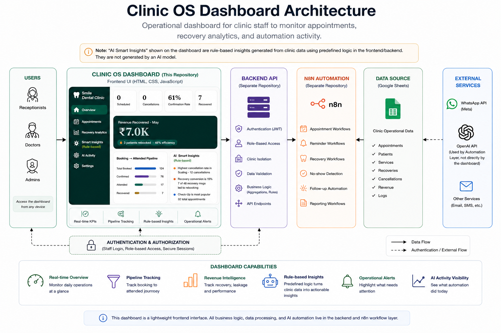
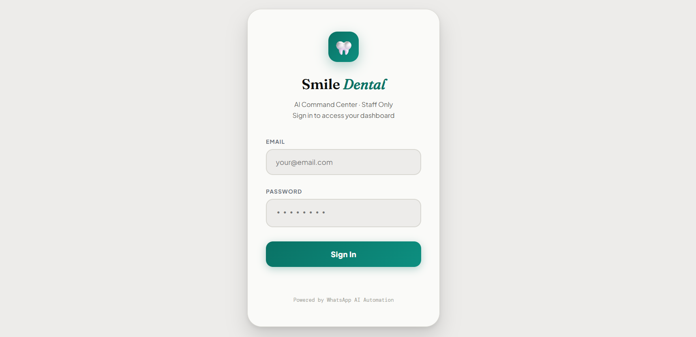
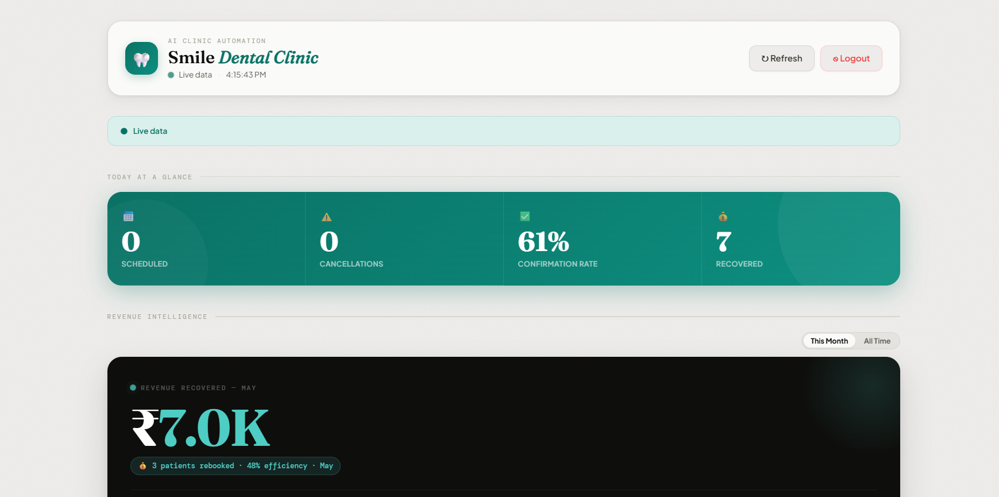
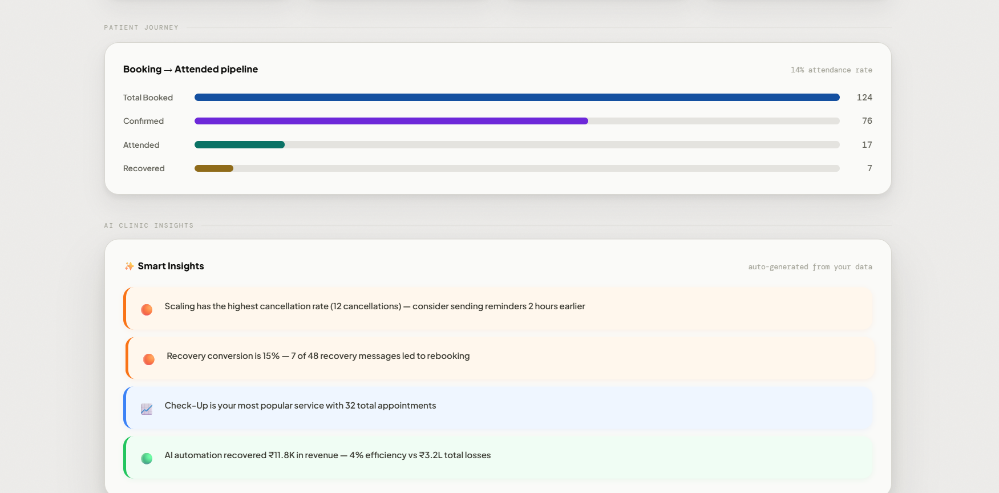
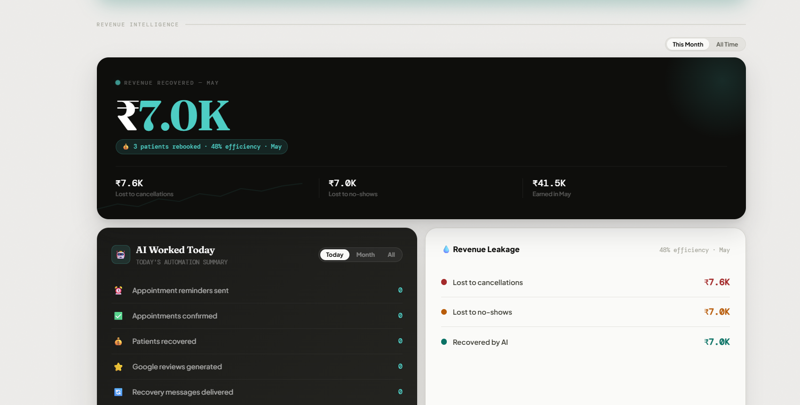
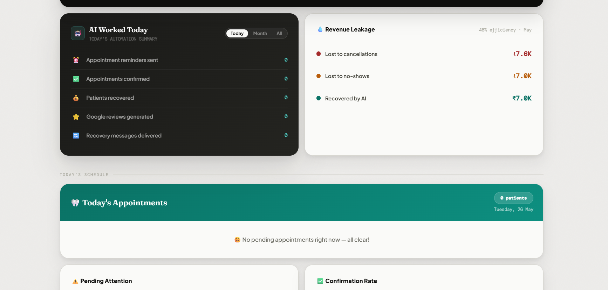

# Clinic OS Dashboard

The live operational dashboard for Clinic OS — the interface clinic staff use to monitor appointments, automation activity, and recovery analytics in real time.

---

## Overview

This repository contains the frontend dashboard for Clinic OS. It's the screen clinic staff open during a shift to answer one question: *what's happening right now, and is the automation working?*

Staff authenticate through the Clinic OS backend, which manages authentication and role-based access. Once signed in, the dashboard retrieves clinic-specific operational data from the automation layer and presents live appointment, recovery, and workflow metrics.

This repository contains only the frontend dashboard. Authentication, backend services, and workflow automation are maintained in the related Clinic OS Backend [clinic-os-backend](https://github.com/GDR-26/clinic-os-backend) and Clinic OS repositories [clinic-os](https://github.com/GDR-26/clinic-os).

---

## Highlights

- JWT-based staff login with silent refresh (via clinic-os-backend)
- Role-based access (admin / doctor / receptionist)
- Per-clinic data isolation — each clinic's dashboard reads from its own webhook, not a shared source
- Live appointment data pulled from that clinic's n8n automation layer
- Today-at-a-glance KPIs (scheduled, cancellations, confirmation rate, recovered)
- Revenue intelligence: recovered revenue, lost-to-cancellations, lost-to-no-shows
- Rule-based Smart Insights generated from clinic metrics (e.g. flagging the service with the highest cancellation rate) — predefined logic, not an AI model call
- Booking → Confirmed → Attended → Recovered pipeline visualization
- Service popularity breakdown
- No-show and recovery tracking, including rebook conversion rate
- Automation activity log ("AI Worked Today" — reminders sent, reviews generated, recovery messages delivered)
- Visit history log per patient
- Graceful fallback to sample data with a visible status message if a clinic's webhook isn't configured or unreachable
- Lightweight, dependency-free frontend (HTML/CSS/JS)

---

## Why I Built This

Most of the clinic automation in Clinic OS happens invisibly — reminders go out, no-shows get flagged, recovery messages fire over WhatsApp. Without a dashboard, staff have no way to see any of that, short of digging through a spreadsheet. Receptionists need a fast answer to "what happened today," and admins need to know whether the automation is actually recovering lost revenue or just running in the background unverified.

This dashboard exists to close that gap: one screen, gated to the right staff, showing live data pulled straight from the automation layer — not a report generated after the fact, but the current state of the clinic.

---

## Architecture



```
Staff Login → clinic-os-backend (JWT issued, role checked)
                      ↓
        Dashboard UI (this repo) — stores JWT, attaches it to every request
                      ↓
   Backend returns this clinic's webhook URL + token
                      ↓
   n8n / Google Sheets (this clinic's live booking + automation data)
                      ↓
        Rendered KPIs, pipeline, rule-based insights, activity log
```

The dashboard is responsible only for presenting operational data. Authentication and role-based access are handled by the Clinic OS Backend, while live appointment and workflow data are supplied by the automation layer through Google Sheets. This separation keeps the frontend lightweight while allowing backend services and automation workflows to evolve independently.

Smart Insights are derived from operational metrics using predefined rules rather than AI model inference. Language models are used within the automation workflows for conversational tasks, not for dashboard analytics.

---

## Dashboard Modules

### Login
Staff sign-in against clinic-os-backend. A successful login returns a JWT (access + refresh token), stored for the session and attached to every subsequent request.

### Today at a Glance
The landing view: today's scheduled appointments, cancellations, confirmation rate, and patients recovered, pulled live from the clinic's webhook.

### Revenue Intelligence
Total revenue recovered (all-time and monthly), broken down against revenue lost to cancellations and no-shows.

### AI Worked Today
A daily automation activity log: reminders sent, appointments confirmed, patients recovered, Google reviews generated, and recovery messages delivered.

### Patient Journey / Smart Insights
A booking → confirmed → attended → recovered pipeline paired with operational insights derived from clinic metrics, helping staff quickly identify trends such as high cancellation services and recovery effectiveness.

### Clinic Metrics & Services Popularity
Total bookings (all-time and monthly), no-show rate, and a breakdown of appointments by service type.

### No-show & Recovery
Tracks total no-shows, recovery messages sent, patients rebooked, and rebook conversion rate.

### Visit History
A log of individual patient visits with status (attended / no-show), service, date, and booking ID.

---

## Design Principles

- **Information hierarchy** — today's most time-sensitive numbers sit at the top; deeper analytics live further down.
- **Operational efficiency** — built to be scanned in seconds during a shift, not read like a report.
- **Clarity over density** — each panel answers one question rather than combining everything into a single dense view.
- **AI assists, doesn't replace** — automation activity is made visible and verifiable, allowing staff to understand and trust the workflows supporting daily clinic operations.
- **Access follows role, data follows clinic** — staff only see the dashboard after the backend confirms their role, and only ever see their own clinic's data.

---

## Engineering Decisions

**Why gate login through the backend instead of talking to Supabase directly?** The dashboard surfaces real patient and revenue data, so authentication needed to be centralized and consistent with the rest of Clinic OS. Routing login through clinic-os-backend means the dashboard inherits the same JWT/RBAC system the rest of the platform uses, instead of maintaining its own auth logic or querying Supabase from client-side code.

**Why fetch webhook credentials per clinic instead of hardcoding one?** Clinic OS is multi-tenant — different clinics have different n8n instances and data. Fetching each clinic's webhook URL and token from the backend after login, rather than embedding one in the frontend, keeps clinics' data isolated and keeps no credentials in client-side source.

**Why keep Smart Insights rule-based instead of calling an LLM?** The insights here are simple, deterministic patterns (highest cancellation rate, most popular service) that don't need a model call to compute reliably — a threshold check is faster, cheaper, and fully predictable. Model reasoning is used where it's actually needed: understanding open-ended WhatsApp conversations in the automation layer, not for summarizing numbers the dashboard already has.

**Why HTML/CSS/JS instead of a framework?** This dashboard was built to validate product design and the operational workflow — what staff actually need to see, and in what order — before investing in a framework. A plain implementation kept iteration fast while that was still being figured out.

**Why fall back to sample data instead of failing silently?** If a clinic's webhook isn't configured yet or the connection drops, showing a blank or broken dashboard is worse than showing clearly-labeled sample data with a status message. This keeps the interface usable during setup or an outage instead of looking like it's broken.

---

## Tech Stack

| Layer | Technology |
|---|---|
| Structure | HTML |
| Styling | CSS |
| Interactivity | JavaScript |
| Authentication | JWT via clinic-os-backend (Node.js/Express, Supabase-backed) |
| Live data | n8n / Google Sheets, per-clinic webhook |

---

## Screenshots

*Screenshots below reflect an earlier state of the dashboard and are due for an update to match the current live version (Smart Insights, Booking Status breakdown, and Visit History are not yet pictured).*

### Login Screen

Staff sign-in against the Clinic OS backend.

### Dashboard Overview

Today's scheduled appointments, cancellations, confirmation rate, and recovered revenue.

### Smart Insights

Booking → attended pipeline alongside rule-based insights.

### Recovery Analytics

Revenue recovered vs. revenue lost to cancellations and no-shows.

### Appointment Intelligence

Daily automation activity log paired with today's live schedule.

---

## Future Improvements

- Refreshed screenshots reflecting the current feature set
- Role-differentiated views (currently role gates login access, not what's displayed post-login)
- Real-time push notifications for cancellations and no-shows
- Mobile responsiveness
- Multi-clinic switcher for staff with access to more than one clinic

---

## Lessons Learned

Building this taught me more about what clinic staff actually need to see than about frontend code itself. The early version tried to show everything at once; the more useful version turned out to be a small number of focused panels that each answer one clear question.

The bigger lesson was that operational dashboards should prioritize clarity over complexity. Staff trust automation more when they can clearly see what happened, why it happened, and how those workflows affect clinic operations. Designing for transparency proved more valuable than making the interface appear more intelligent than it really is.

---

## Related Repositories

This dashboard is one component of the complete Clinic OS platform.

- [clinic-os](https://github.com/GDR-26/clinic-os) — WhatsApp AI booking automation and workflow layer
- [clinic-os-backend](https://github.com/GDR-26/clinic-os-backend) — authentication, RBAC, and Supabase-backed API

---

## Connect

* 💼 **LinkedIn:** https://linkedin.com/in/dhruva-reddy-gaddam
* 🌐 **Portfolio:** https://gdr-26-portfolio.netlify.app/
* 📧 **Email:** dhruvareddy26@gmail.com
